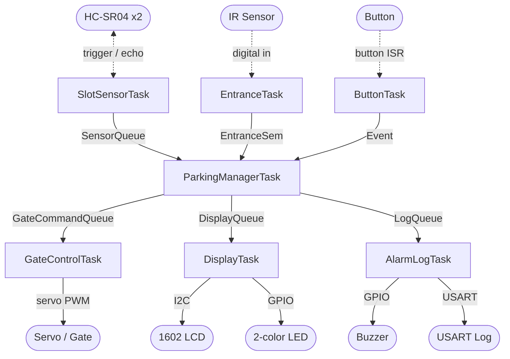

# Smart Parking Term Project

uC/OS-III 기반 스마트 주차장 빈자리 감지 및 차량 입차 제어 시스템이다.  
소형 모형 주차장을 대상으로 주차칸 점유 상태를 감지하고, 빈자리가 있을 때만 차량 입차를 허용하는 구조를 구현한다.

## Project Overview

본 프로젝트는 운전자가 직접 빈자리를 확인해야 하는 소규모 주차장 상황을 단순화한 임베디드 시스템이다. STM32 NUCLEO 보드와 uC/OS-III를 사용하여 센서 입력, 상태 판단, 차단기 제어, 상태 표시, 경고 출력, USART 로그를 여러 태스크로 나누어 처리한다.

기본 구현은 주차칸 2개를 대상으로 한다. 각 주차칸은 초음파 거리 센서로 점유 여부를 판단하며, 입구 차량 접근은 적외선 장애물 감지 센서로 처리한다. 빈자리가 있으면 서보모터 차단기를 열고, 만차 상태이면 차단기를 열지 않고 LED와 부저로 입차 불가 상태를 알린다.

출차는 별도 출구 센서를 두지 않고 관리자 버튼 이벤트로 처리한다. 단, 버튼이 주차칸 상태를 직접 비우지는 않는다. 실제 빈자리 수와 점유 상태는 초음파 센서 측정 결과로만 갱신한다.

## Core Features

- 2개 주차칸 점유 상태 감지
- HC-SR04 초음파 센서 순차 측정
- 입구 차량 접근 감지
- 빈자리 존재 시 차단기 개방
- 만차 시 입차 거부
- 1602 I2C Character LCD 상태 표시
- 2색 LED를 이용한 입차 가능/만차 표시
- 부저를 이용한 만차 또는 동작 피드백
- 버튼 기반 출차 이벤트 처리
- USART 기반 상태 및 이벤트 로그 출력
- 센서/상태 배열 확장을 통한 4개 주차칸 확장 가능 구조

## Hardware Components

| Component | Count | Role |
|---|---:|---|
| STM32 NUCLEO-F429ZI/F439ZI | 1 | 전체 시스템 제어 및 uC/OS-III 실행 |
| HC-SR04 Ultrasonic Sensor | 2 | 각 주차칸 점유 여부 감지 |
| IR Obstacle Sensor | 1 | 입구 차량 접근 감지 |
| Metal Gear Servo Motor | 1 | 입구 차단기 열림/닫힘 제어 |
| 1602 I2C Character LCD | 1 | 주차장 상태 요약 표시 |
| 2-color LED Module | 1 | 입차 가능/만차 상태 표시 |
| Passive Buzzer Module | 1 | 만차 경고 및 동작 피드백 |
| Button Module | 1 | 출차 이벤트 및 관리자 수동 입력 |
| Resistors | several | HC-SR04 Echo 분압 회로 구성 |
| External 5V Power | 1 | 서보모터 구동 전원 |

## System Flow

```text
SlotSensorTask
  -> ParkingManagerTask
  -> DisplayTask / GateControlTask / AlarmLogTask

EntranceTask
  -> ParkingManagerTask
  -> GateControlTask

ButtonTask
  -> ParkingManagerTask
  -> LogQueue
```



기본 동작 흐름은 다음과 같다.

1. `SlotSensorTask`가 2개의 초음파 센서를 순차적으로 측정한다.
2. 측정값은 `SensorQueue`를 통해 `ParkingManagerTask`로 전달된다.
3. `ParkingManagerTask`는 각 주차칸을 `EMPTY` 또는 `OCCUPIED`로 판단한다.
4. `EntranceTask`가 입구 차량 접근을 감지하면 입차 요청 이벤트를 발생시킨다.
5. 빈자리가 있으면 `GateControlTask`가 서보모터 차단기를 연다.
6. 만차이면 차단기를 닫은 상태로 유지하고 LED/부저/USART 로그로 입차 거부를 알린다.
7. 출차 버튼이 눌리면 출차 이벤트를 기록한다.
8. 차량이 실제로 제거되어 초음파 거리값이 바뀌면 빈자리 수가 갱신된다.

## RTOS Task Design

| Task | Role |
|---|---|
| `SlotSensorTask` | HC-SR04 센서를 순차 구동하고 주차칸별 거리값을 측정 |
| `EntranceTask` | 적외선 센서로 입구 차량 접근 여부를 감지 |
| `ParkingManagerTask` | 주차칸 상태, 빈자리 수, 입차 허용 여부를 판단 |
| `GateControlTask` | 서보모터를 이용하여 차단기 열림/닫힘 제어 |
| `DisplayTask` | 1602 I2C LCD와 2색 LED 상태 표시 |
| `AlarmLogTask` | 부저 출력과 USART 로그 출력 |
| `ButtonTask` | 출차 버튼 디바운싱 및 출차 이벤트 전달 |

`ParkingManagerTask`를 시스템 상태의 중심으로 둔다. 다른 task는 주차장 상태를 직접 수정하지 않고, queue나 semaphore를 통해 이벤트 또는 측정값을 전달한다. 이를 통해 상태 변경 지점을 줄이고 race condition을 방지한다.

## Inter-task Communication

| Sender | Receiver | Object | Data |
|---|---|---|---|
| `SlotSensorTask` | `ParkingManagerTask` | `SensorQueue` | 센서 번호, 거리값 |
| `EntranceTask` | `ParkingManagerTask` | `EntranceSem` or Event Flag | 입구 차량 접근 이벤트 |
| `ParkingManagerTask` | `GateControlTask` | `GateCommandQueue` | `GATE_OPEN`, `GATE_CLOSE`, `GATE_DENY` |
| `ParkingManagerTask` | `DisplayTask` | `DisplayQueue` | 빈자리 수, 주차칸 상태, 차단기 상태 |
| `ParkingManagerTask` | `AlarmLogTask` | `LogQueue` | 이벤트 코드 또는 로그 메시지 |
| `ButtonTask` | `ParkingManagerTask` | Queue or Event Flag | 출차 이벤트, 관리자 이벤트 |

공유 상태가 필요한 경우에는 임계 구역 또는 mutex를 사용한다. 특히 주차칸 상태 배열, 빈자리 수, 차단기 상태, LCD 접근은 여러 task가 동시에 접근할 수 있으므로 보호가 필요하다.

## Display and Log

1602 I2C Character LCD는 16자 x 2줄, 총 32칸만 사용할 수 있으므로 자세한 정보보다는 요약 상태를 표시한다.

예시:

```text
FREE:1/2 S1:O
S2:E G:CLOSED
```

상세 센서값과 이벤트 흐름은 USART 로그로 확인한다.

예시:

```text
[SENSOR] slot=1 distance=12.4cm state=OCCUPIED
[SENSOR] slot=2 distance=38.1cm state=EMPTY
[STATE] empty=1/2 gate=CLOSED
[EVENT] entrance_detected
[GATE] open
[GATE] close
[ALARM] parking_full entrance_denied
[BUTTON] exit_event_logged
```

## Demo Scenario

시연 영상은 다음 순서로 구성한다.

1. 시스템 부팅 후 LCD와 USART 초기 상태 확인
2. 초음파 센서로 2개 주차칸 상태 표시
3. 빈자리가 있는 상태에서 입구 차량 접근
4. 차단기 개방 및 입차 허용 로그 확인
5. 두 주차칸이 모두 점유된 만차 상태 구성
6. 만차 상태에서 입구 차량 접근
7. 차단기 닫힘 유지, LED/부저 경고, USART 거부 로그 확인
8. 출차 버튼 입력
9. 차량 제거 후 초음파 센서 기반으로 빈자리 갱신
10. LCD와 USART 로그로 최종 상태 확인

## Extension Plan

기본 구현은 주차칸 2개로 진행한다. 구조적으로는 다음 항목을 배열 기반으로 관리하여 4개 주차칸까지 확장할 수 있다.

- 초음파 센서 trigger/echo 핀 배열
- 주차칸 거리값 배열
- 주차칸 상태 배열
- 빈자리 수 계산 루프
- LCD/USART 표시 형식

다만 1602 LCD는 표시 공간이 제한되므로 4칸 확장 시 LCD에는 요약 정보만 표시하고, 자세한 상태는 USART 로그로 확인한다.

## Implementation Notes

- HC-SR04 Echo 출력은 5V일 수 있으므로 STM32 GPIO 입력 보호를 위해 전압 분압 회로를 사용한다.
- 여러 초음파 센서를 동시에 trigger하면 간섭이 생길 수 있으므로 반드시 순차 측정한다.
- 서보모터는 STM32 보드 전원만으로 구동하지 않고 별도 5V 전원을 사용한다.
- 서보모터 전원 GND와 STM32 GND는 공통으로 연결한다.
- ISR 안에서는 긴 처리, delay, USART 출력 등을 수행하지 않는다.
- ISR은 semaphore post 또는 queue post 정도만 수행하고 실제 처리는 task에서 수행한다.
- LCD는 I2C 주소가 `0x27` 또는 `0x3F`일 수 있으므로 실제 모듈 주소를 확인한다.
- 구현 일정이 부족하면 LCD 표시와 로그 형식을 단순화하고, 입차 감지, 초음파 기반 상태 판단, 차단기 제어를 먼저 완성한다.

## Related Files

```text
assign/term/termproject_initial.md          # 텀프로젝트 제안서 원본
assign/term/termproject_initial_eisvogel.pdf # 제안서 PDF
assign/term/build_pdf_eisvogel.sh           # 제안서 PDF 생성 스크립트
app/src/app.c                               # 실제 펌웨어 빌드 대상 코드
```
